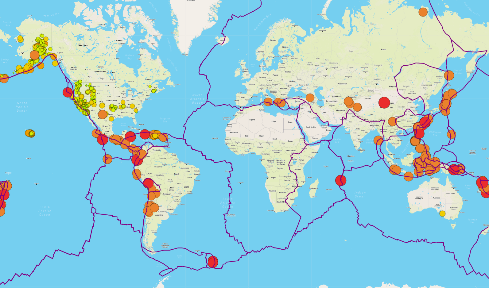
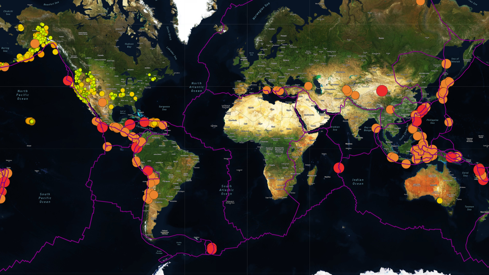
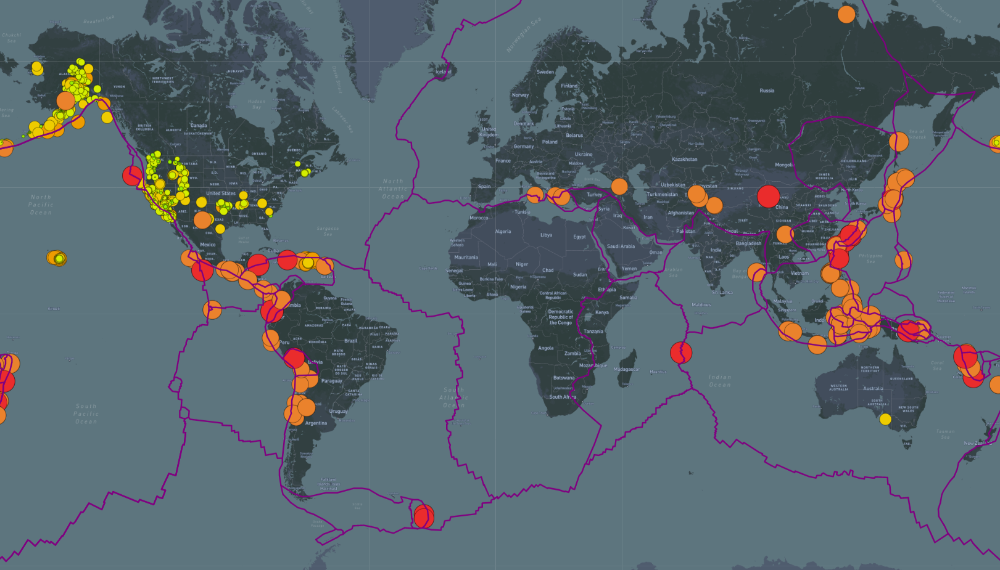

# Mapping_Earthquakes

## Resources
*   Data:
    *   [Earthquake GeoJSON ](https://earthquake.usgs.gov/earthquakes/feed/v1.0/summary/4.5_week.geojson)
    *   [Tectonic Plate Boundary JSON](https://raw.githubusercontent.com/fraxen/tectonicplates/master/GeoJSON/PB2002_boundaries.json)
*   Utilities:
    *   [Mapbox API](https://www.mapbox.com/)
    *   [Leaflet.js 1.7.1](https://leafletjs.com/SlavaUkraini/index.html)
    *   [D3.js v5](https://d3js.org/)
*   Software:
    *   Visual Studio Code 1.63.1
    *   Google Chrome 99.0.4844.84

## Overview
The goal of this project was to generate a interactive map using JavaScript, Leaflet.js, HTML, and GeoJSON files. This map shows and updates earthquake data from the last 7 days and the user can toggle different overlays and map styles. 

These include:
*   Overlays:
    *   Earthquakes
    *   Tectonic Plates
    *   Major Earthquakes
*   Map Styles
    *   Streets
    *   Satellite
    *   Navigation

## Results

Each earthquake data point on the map is a circle with a radius and color that matches the earthquakes magnitude, the large and more red the circle the stronger the event. The tectonic plates are the color purple so they can be easily seen on any map style.

### Streets

### Satellite

### Navigation

